# Taller-3: Arquitectura N-Capas con Múltiples ORMs

## 📖 Descripción

Este proyecto implementa una **arquitectura N-Capas (Clean Architecture)** aplicada a las entidades de un sistema de análisis de audio con IA. El sistema permite gestionar grabaciones, métricas, parámetros ideales, tipos de métricas y feedbacks de análisis, demostrando el uso de múltiples ORMs de forma intercambiable.

## 📋 Actividades Obligatorias

### 🎯 Requerimientos Implementados

| # | Actividad Obligatoria | Implementación |
|---|----------------------|----------------|
| 1 | **Estructurar servicio REST con Arquitectura N-Capas** | 4 capas bien definidas: Domain, Infrastructure, Presentation, Data |
| 2 | **Definir abstracciones adecuadas de cada capa** | Interfaces, Repository Pattern, Use Cases, DTOs |
| 3 | **Experimentar con múltiples librerías ORM** | TypeORM (PostgreSQL) + Sequelize (SQLite) |
| 4 | **Implementar capa de datos flexible** | Factory Pattern con intercambio dinámico via `ORM_TYPE` |
| 5 | **Separación correcta de responsabilidades** | Clean Architecture principles aplicados |
| 6 | **Capacidad de intercambiar tecnologías** | Cambio entre ORMs sin afectar lógica de negocio |
| 7 | **Aplicar a entidades del proyecto autónomo** | Sistema de análisis de audio con IA implementado |

## 🏗️ Arquitectura

### Capas Implementadas

```
src/
├── domain/                    # 🔵 CAPA DE DOMINIO
│   ├── entities/             # Entidades de negocio
│   ├── dtos/                 # Data Transfer Objects
│   ├── repositories/         # Contratos de repositorios
│   ├── datasources/          # Contratos de fuentes de datos
│   └── use-cases/            # Casos de uso de negocio
├── infrastructure/           # 🟡 CAPA DE INFRAESTRUCTURA
│   ├── datasource/          # Implementaciones de datasources
│   └── repositories/        # Implementaciones de repositorios
├── presentation/            # 🟢 CAPA DE PRESENTACIÓN
│   ├── controllers/         # Controladores HTTP
│   ├── routes/             # Definición de rutas
│   └── server.ts           # Configuración del servidor
├── data/                   # 🔴 CAPA DE DATOS
│   ├── typeorm/           # Configuración TypeORM
│   └── sequelize/         # Configuración Sequelize
└── config/                # ⚙️ CONFIGURACIÓN
    └── envs.ts           # Variables de entorno
```

## 🗃️ Entidades del Dominio

### 1. **TipoMetrica** 
- Catálogo para mantener escalabilidad de tipos de métricas
- Campos: `id`, `nombre`, `descripcion`, `activo`

### 2. **Metrica**
- Detalle de las métricas individuales (velocidad, pausas, claridad, etc.)
- Campos: `id`, `nombre`, `descripcion`, `tipoMetricaId`, `unidadMedida`, `valorMinimo`, `valorMaximo`, `activo`

### 3. **ParametroIdeal** 
- Valores de referencia para análisis
- Campos: `id`, `metricaId`, `valorIdeal`, `toleranciaMinima`, `toleranciaMaxima`, `descripcion`, `activo`

### 4. **Grabacion**
- Insumo principal para analizar con IA
- Campos: `id`, `nombreArchivo`, `rutaArchivo`, `duracion`, `formato`, `fechaGrabacion`, `tamanioArchivo`, `procesado`

### 5. **Feedback**
- Base del análisis automático/manual
- Campos: `id`, `grabacionId`, `parametroIdealId`, `valorObtenido`, `puntuacion`, `comentario`, `esManual`, `fechaAnalisis`, `confiabilidad`

## 🚀 Instalación y Ejecución

### Prerrequisitos
- Node.js (v18 o superior)
- PostgreSQL (para TypeORM)
- Git

### Pasos de instalación

```bash
# Clonar el repositorio
git clone <repository-url>
cd Taller-3

# Instalar dependencias
npm install

# Configurar variables de entorno
cp .env.example .env
# Editar .env con tus configuraciones

# Compilar TypeScript
npm run build

# Ejecutar en desarrollo
npm run dev

# Ejecutar en producción
npm start
```

### Variables de Entorno

```bash
# Puerto del servidor
PORT=3000

# Ruta de archivos públicos
PUBLIC_PATH=public

# Base de datos PostgreSQL (TypeORM)
DB_HOST=localhost
DB_PORT=5432
DB_USERNAME=postgres
DB_PASSWORD=password
DB_NAME=taller3_db

# Base de datos SQLite (Sequelize)
SQLITE_DB_PATH=./database.sqlite

# Configuración de aplicación
NODE_ENV=development
API_PREFIX=/api/v1

# Seleccionar ORM: 'typeorm' o 'sequelize'
ORM_TYPE=typeorm
```

## 🔄 Cambiar entre ORMs

### Para usar TypeORM (PostgreSQL):
```bash
export ORM_TYPE=typeorm
npm run dev
```

### Para usar Sequelize (SQLite):
```bash
export ORM_TYPE=sequelize
npm run dev
```

## 📡 API Endpoints

### Base URL: `http://localhost:3000/api/v1`

### Grabaciones

| Método | Endpoint | Descripción |
|--------|----------|-------------|
| `GET` | `/grabaciones` | Obtener todas las grabaciones |
| `POST` | `/grabaciones` | Crear nueva grabación |
| `GET` | `/grabaciones/:id` | Obtener grabación por ID |
| `PUT` | `/grabaciones/:id` | Actualizar grabación |
| `DELETE` | `/grabaciones/:id` | Eliminar grabación |

### Ejemplo de creación de grabación:

```json
POST /api/v1/grabaciones
Content-Type: application/json

{
  "nombreArchivo": "analisis_voz_01.mp3",
  "rutaArchivo": "/uploads/audio/analisis_voz_01.mp3",
  "duracion": 120.5,
  "formato": "mp3",
  "fechaGrabacion": "2025-06-02T10:30:00Z",
  "tamanioArchivo": 2048000
}
```

### Respuesta exitosa:

```json
{
  "id": 1,
  "nombreArchivo": "analisis_voz_01.mp3",
  "rutaArchivo": "/uploads/audio/analisis_voz_01.mp3",
  "duracion": 120.5,
  "formato": "mp3",
  "fechaGrabacion": "2025-06-02T10:30:00.000Z",
  "tamanioArchivo": 2048000,
  "procesado": false,
  "createdAt": "2025-06-02T15:30:45.123Z",
  "updatedAt": "2025-06-02T15:30:45.123Z"
}
```

## 🧪 Testing con Postman/Insomnia

### Configuración de Postman

1. **Crear nueva colección:** "Taller-3 N-Capas API"
2. **Configurar variables de entorno:**
   - `baseUrl`: `http://localhost:3000`
3. **Headers globales:**
   - `Content-Type`: `application/json`

### Requests de Prueba

#### 📋 Colección Grabaciones

**1. GET - Listar Grabaciones**
- **Método:** `GET`
- **URL:** `{{baseUrl}}/api/v1/grabaciones`

**2. POST - Crear Grabación**
- **Método:** `POST`  
- **URL:** `{{baseUrl}}/api/v1/grabaciones`
- **Body (JSON):**
```json
{
  "nombreArchivo": "analisis_voz_demo.mp3",
  "rutaArchivo": "/uploads/audio/analisis_voz_demo.mp3", 
  "duracion": 125.5,
  "formato": "mp3",
  "fechaGrabacion": "2025-06-03T10:30:00Z",
  "tamanioArchivo": 2048000
}
```

**3. GET - Obtener Grabación por ID**
- **Método:** `GET`
- **URL:** `{{baseUrl}}/api/v1/grabaciones/1`

**4. PUT - Actualizar Grabación**
- **Método:** `PUT`
- **URL:** `{{baseUrl}}/api/v1/grabaciones/1`
- **Body (JSON):**
```json
{
  "procesado": true,
  "duracion": 130.0
}
```

**5. DELETE - Eliminar Grabación**
- **Método:** `DELETE`
- **URL:** `{{baseUrl}}/api/v1/grabaciones/1`

#### 📋 Colección Tipos de Métrica

**1. GET - Listar Tipos**
- **Método:** `GET`
- **URL:** `{{baseUrl}}/api/v1/tipos-metrica`

**2. POST - Crear Tipo**
- **Método:** `POST`
- **URL:** `{{baseUrl}}/api/v1/tipos-metrica`
- **Body (JSON):**
```json
{
  "nombre": "Velocidad de Habla",
  "descripcion": "Métrica para medir palabras por minuto",
  "activo": true
}
```

## 🛠️ Agregar Nuevas Librerías ORM

El sistema está diseñado para ser extensible con nuevos ORMs. Sigue estos pasos:

### Pasos para integrar un nuevo ORM:

1. **Instalar la librería ORM**
```bash
npm install nueva-libreria-orm
npm install @types/nueva-libreria-orm # Si es necesario
```

2. **Crear estructura de datos**
```bash
mkdir src/data/nueva-libreria
touch src/data/nueva-libreria/config.ts
touch src/data/nueva-libreria/models/
```

3. **Crear modelos del ORM**
```typescript
// src/data/nueva-libreria/models/grabacion.model.ts
export interface GrabacionModel {
  // Definir el modelo según la nueva librería
}
```

4. **Implementar datasources**
```typescript
// src/infrastructure/datasource/grabacion-nueva-libreria.datasource.ts
export class GrabacionNuevaLibreriaDatasource implements GrabacionDatasource {
  async create(dto: CreateGrabacionDto): Promise<GrabacionEntity> {
    // Implementar usando la nueva librería
  }
  
  async getAll(): Promise<GrabacionEntity[]> {
    // Implementar usando la nueva librería
  }
  
  // Implementar todos los métodos del contrato
}
```

5. **Crear configuración de inicialización**
```typescript
// src/data/nueva-libreria/config.ts
export const initializeNuevaLibreria = async () => {
  // Configurar conexión y modelos
  console.log('✅ Nueva Librería: Conexión de base de datos inicializada exitosamente');
};
```

6. **Actualizar factory de dependencias**
```typescript
// src/config/dependencies.ts
if (ORM_TYPE === 'nueva-libreria') {
  const { GrabacionNuevaLibreriaDatasource } = await import('../infrastructure/datasource/grabacion-nueva-libreria.datasource');
  return {
    grabacionDatasource: new GrabacionNuevaLibreriaDatasource(),
    // ... otros datasources
  };
}
```

7. **Actualizar app.ts**
```typescript
// src/app.ts
if (ORM_TYPE === 'nueva-libreria') {
  const { initializeNuevaLibreria } = await import('./data/nueva-libreria/config');
  await initializeNuevaLibreria();
}
```

8. **Actualizar variables de entorno**
```bash
# .env
ORM_TYPE=nueva-libreria
NUEVA_LIBRERIA_CONFIG=valor_configuracion
```

### Ejemplo práctico - Agregar Mongoose:

1. `npm install mongoose @types/mongoose`
2. Crear `src/data/mongoose/` con modelos
3. Implementar `GrabacionMongooseDatasource`
4. Agregar configuración en `app.ts`
5. Usar `ORM_TYPE=mongoose`

Este diseño garantiza que **cualquier ORM** puede ser integrado sin modificar la lógica de negocio.

## 🏛️ Patrones de Diseño Implementados

### 1. **Repository Pattern**
- Abstrae el acceso a datos
- Permite intercambiar implementaciones
- Ubicación: `src/domain/repositories/`

### 2. **Dependency Injection**
- Inyección de dependencias en constructores
- Inversión de control
- Ejemplo: Controladores reciben casos de uso

### 3. **Use Case Pattern**
- Encapsula lógica de negocio
- Un caso de uso por acción
- Ubicación: `src/domain/use-cases/`

### 4. **DTO Pattern**
- Transferencia de datos entre capas
- Validación de entrada
- Ubicación: `src/domain/dtos/`

### 5. **Mapper Pattern**
- Convierte entre entidades y modelos ORM
- Ubicación: `src/data/typeorm/mappers/`

## 📊 Stack Tecnológico

- **Lenguaje:** TypeScript
- **Framework Web:** Express.js
- **ORM Principal:** TypeORM
- **ORM Alternativo:** Sequelize
- **Base de Datos Principal:** PostgreSQL
- **Base de Datos Alternativa:** SQLite
- **Validación:** DTOs con validación custom
- **Arquitectura:** Clean Architecture / N-Capas

## 🎯 Características Destacadas

- **Separación de capas clara** con responsabilidades bien definidas
- **Dominio independiente de infraestructura** siguiendo Clean Architecture
- **Múltiples ORMs intercambiables** (TypeORM y Sequelize)
- **Repository Pattern** para abstracción de datos
- **Dependency Injection** en toda la aplicación
- **DTOs con validación** para transferencia de datos
- **Casos de uso** encapsulando lógica de negocio
- **API REST completa** con todos los endpoints CRUD
- **TypeScript en modo estricto** para mayor seguridad de tipos
- **Configuración flexible** mediante variables de entorno

## 📊 Evidencias de Funcionamiento

Las siguientes capturas demuestran el funcionamiento correcto de las APIs implementadas usando Postman para realizar pruebas de todos los endpoints CRUD.

### 🎯 API de Grabaciones

#### 1. GET - Listar Grabaciones (Estado Inicial)
**Endpoint:** `GET /api/v1/grabaciones`

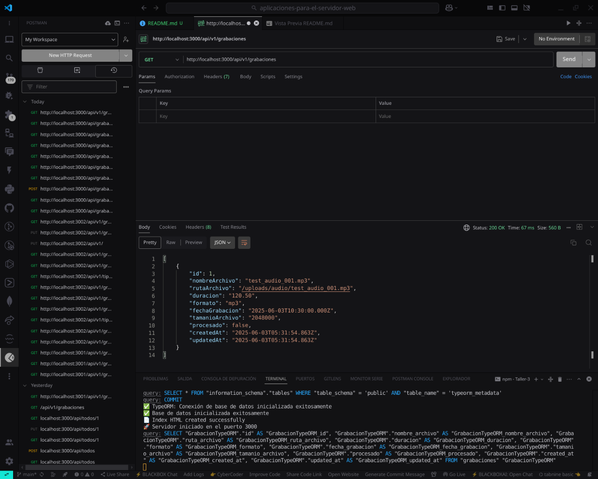

*Respuesta inicial con lista vacía de grabaciones.*

---

#### 2. POST - Crear Nueva Grabación 
**Endpoint:** `POST /api/v1/grabaciones`

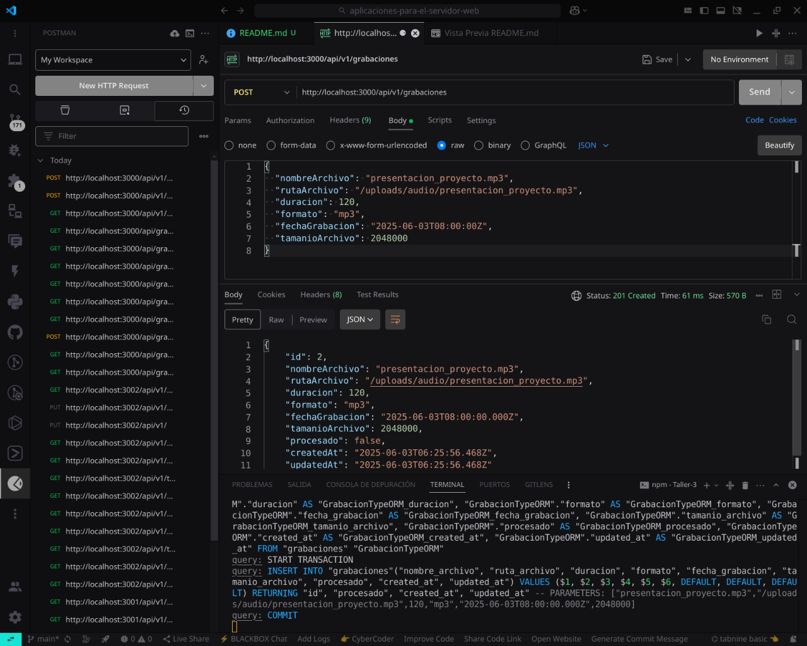

*Creación de una nueva grabación con datos completos.*

---

#### 3. GET - Listar Grabaciones (Con Datos)
**Endpoint:** `GET /api/v1/grabaciones`

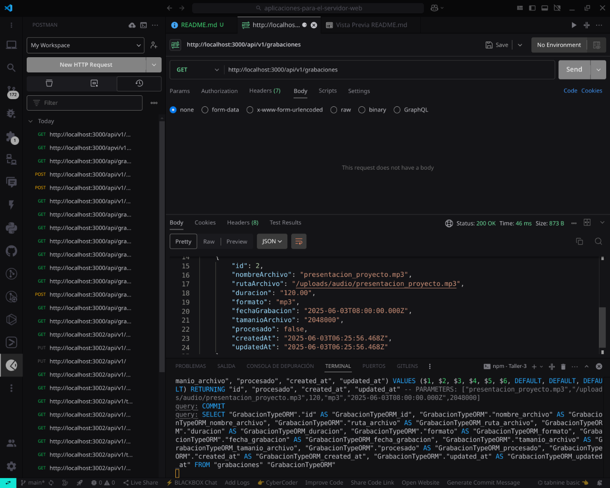

*Visualización de las grabaciones existentes en el sistema.*

---

#### 4. GET - Obtener Grabación por ID
**Endpoint:** `GET /api/v1/grabaciones/{id}`

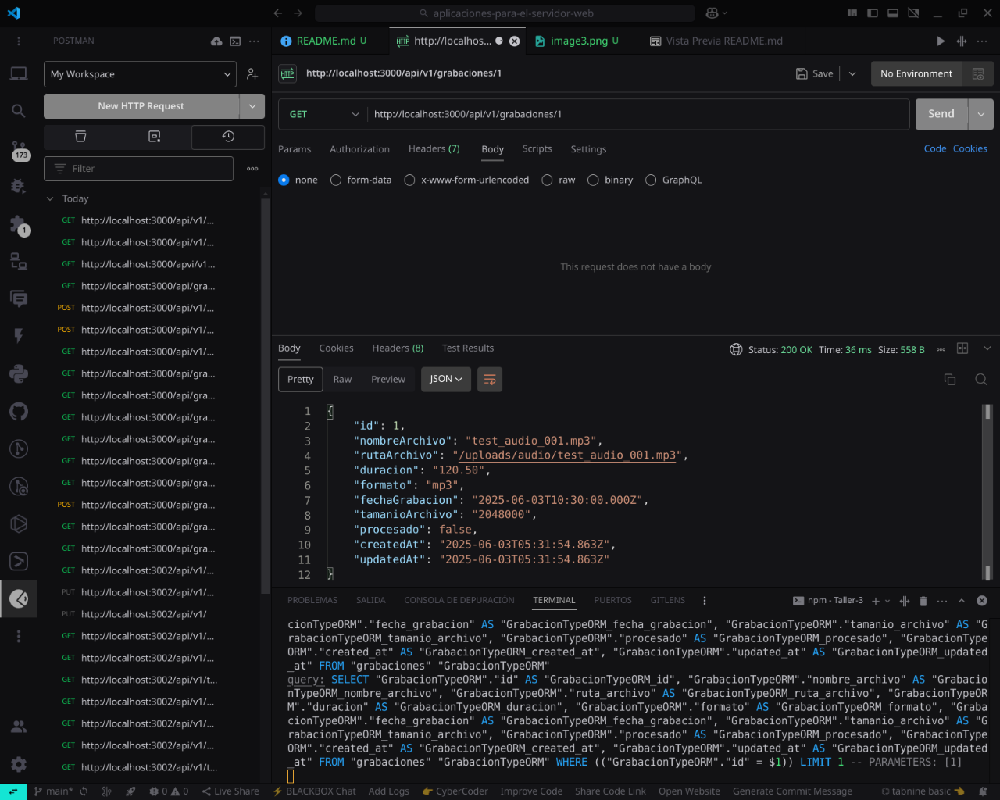

*Consulta de una grabación específica usando su identificador.*

---

#### 5. PUT - Actualizar Grabación
**Endpoint:** `PUT /api/v1/grabaciones/{id}`

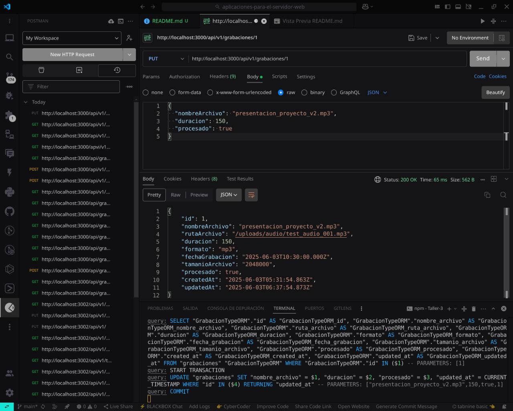

*Actualización de datos de una grabación existente.*

---

#### 6. DELETE - Eliminar Grabación
**Endpoint:** `DELETE /api/v1/grabaciones/{id}`

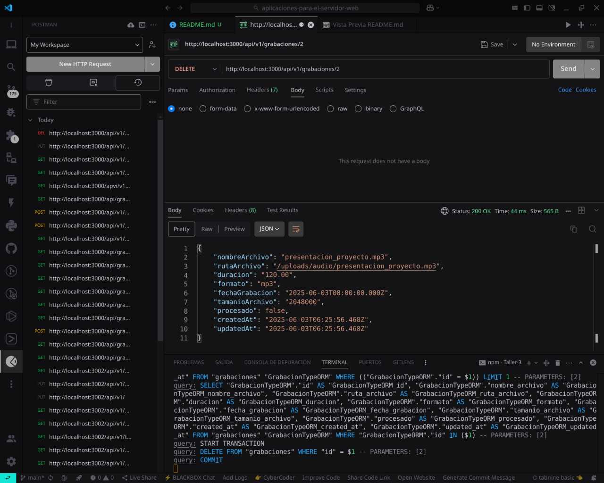

*Eliminación de una grabación del sistema.*

---

### 🎯 API de Tipos de Métrica

#### 1. GET - Listar Tipos de Métrica (Estado Inicial)
**Endpoint:** `GET /api/v1/tipos-metrica`


*Respuesta inicial con lista vacía de tipos de métrica.*

---

#### 2. POST - Crear Primer Tipo de Métrica
**Endpoint:** `POST /api/v1/tipos-metrica`

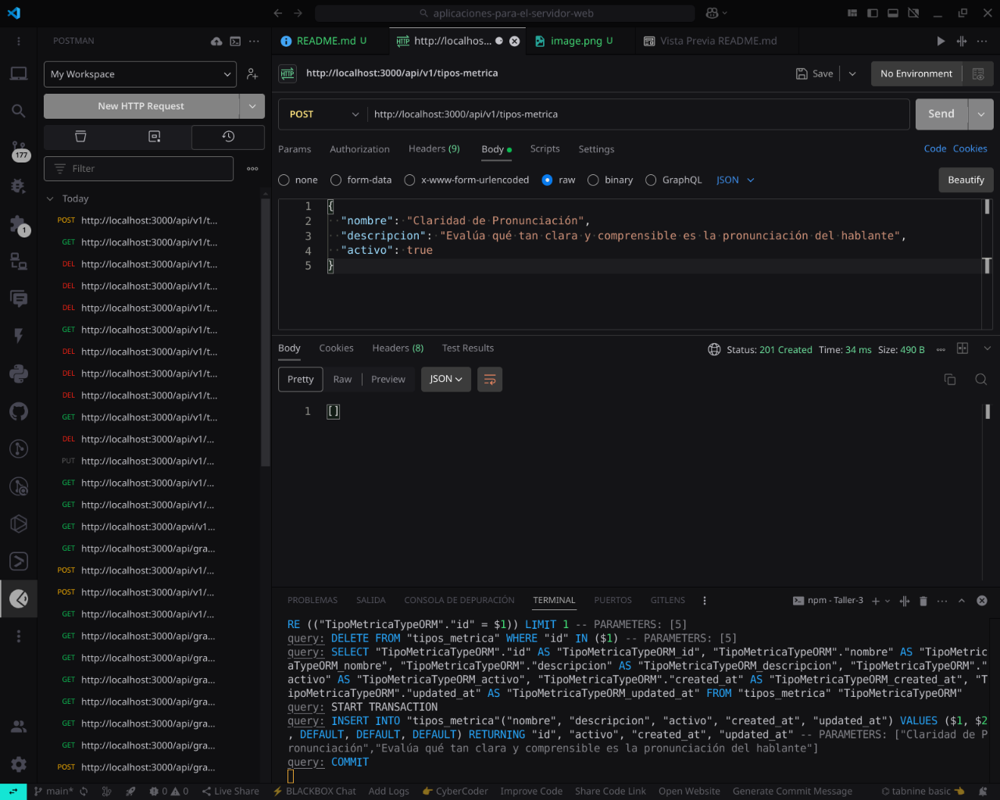

*Creación del primer tipo de métrica con datos completos.*

---

#### 3. POST - Crear Segundo Tipo de Métrica
**Endpoint:** `POST /api/v1/tipos-metrica`

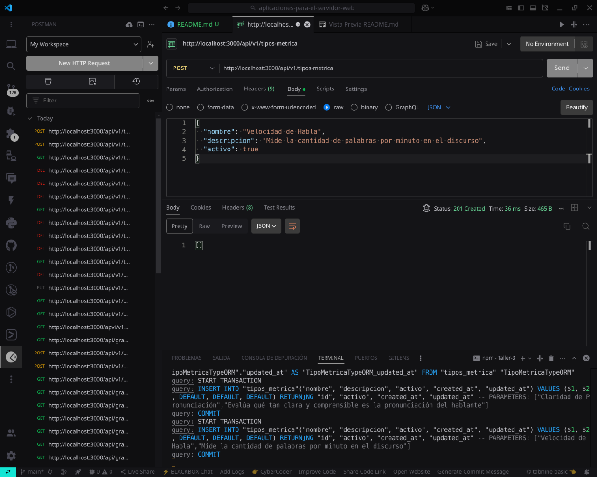

*Creación de un segundo tipo de métrica para diversificar las opciones.*

---

#### 4. GET - Listar Tipos de Métrica (Con Datos)
**Endpoint:** `GET /api/v1/tipos-metrica`

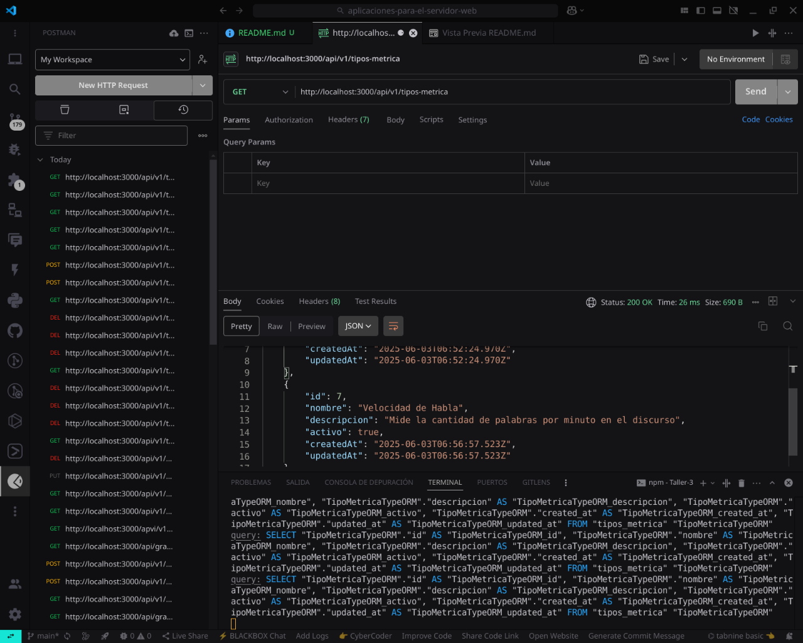

*Visualización de todos los tipos de métrica registrados.*

---

#### 5. GET - Obtener Tipo de Métrica por ID
**Endpoint:** `GET /api/v1/tipos-metrica/{id}`

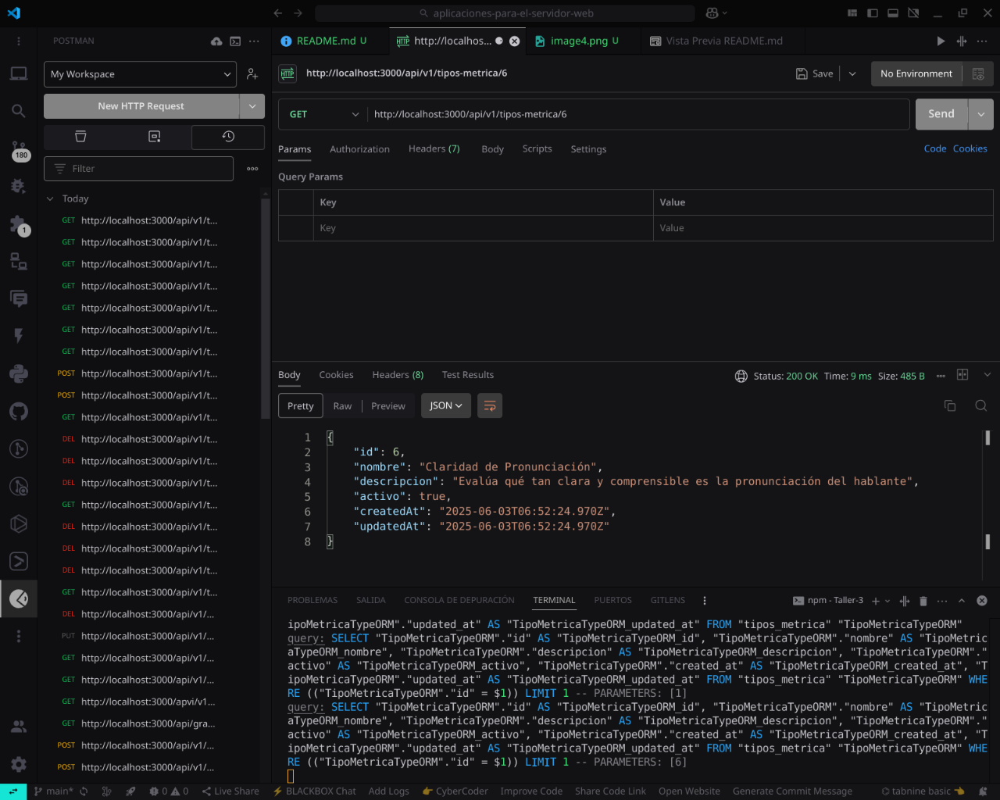

*Consulta de un tipo de métrica específico usando su identificador.*

---

#### 6. PUT - Actualizar Tipo de Métrica
**Endpoint:** `PUT /api/v1/tipos-metrica/{id}`

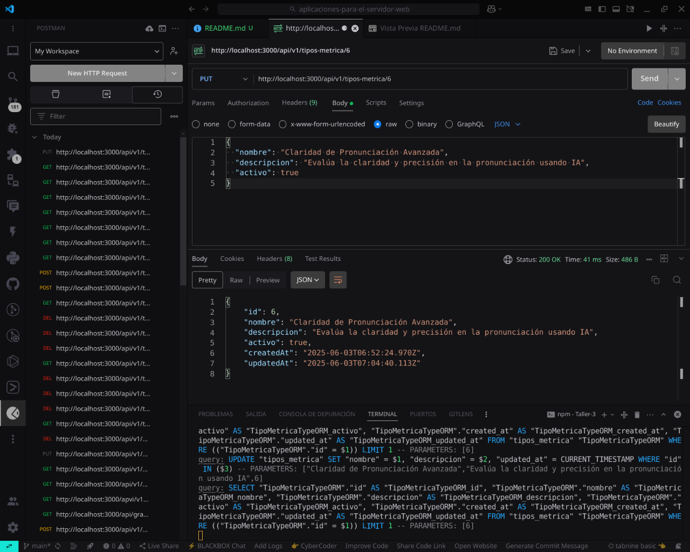

*Actualización de datos de un tipo de métrica existente.*

---

#### 7. DELETE - Eliminar Tipo de Métrica
**Endpoint:** `DELETE /api/v1/tipos-metrica/{id}`

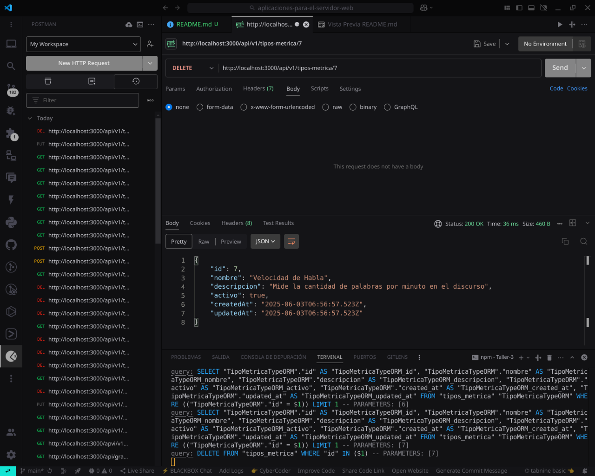

*Eliminación de un tipo de métrica del sistema.*

---

### 📁 Resumen de Evidencias

#### Estructura de archivos de prueba:
```
evidencia/
├── grabaciones/ (6 capturas)
│   ├── image.png   - GET Lista vacía
│   ├── image2.png  - POST Crear grabación
│   ├── image3.png  - GET Lista con datos
│   ├── image4.png  - GET Por ID
│   ├── image5.png  - PUT Actualizar
│   └── image6.png  - DELETE Eliminar
└── tipos-metrica/ (7 capturas)
    ├── image.png   - GET Lista vacía
    ├── image2.png  - POST Crear primer tipo
    ├── image3.png  - POST Crear segundo tipo
    ├── image4.png  - GET Lista con datos
    ├── image5.png  - GET Por ID
    ├── image6.png  - PUT Actualizar
    └── image7.png  - DELETE Eliminar
```

**Total: 13 capturas de Postman documentando el funcionamiento de ambas APIs.**

---

## 📝 Conclusiones

Este proyecto implementa una arquitectura N-Capas robusta que demuestra:

1. **Separación clara de responsabilidades** entre las diferentes capas del sistema
2. **Flexibilidad tecnológica** permitiendo intercambiar ORMs sin afectar la lógica de negocio  
3. **Buenas prácticas de desarrollo** aplicando patrones como Repository, Use Cases y DTOs
4. **Aplicación práctica** a un dominio real de análisis de audio con IA
5. **Extensibilidad** para incorporar nuevas tecnologías ORM en el futuro

La implementación cumple con todos los requerimientos establecidos y proporciona una base sólida para el desarrollo de aplicaciones empresariales escalables.

---

**👨‍💻 Autor:** William Cabrera  
**📅 Fecha:** 2 de junio de 2025  
**🎓 Universidad:** Universidad Laica Eloy Alfaro de Manabi
**📚 Materia:** Aplicaciones para el Servidor Web
