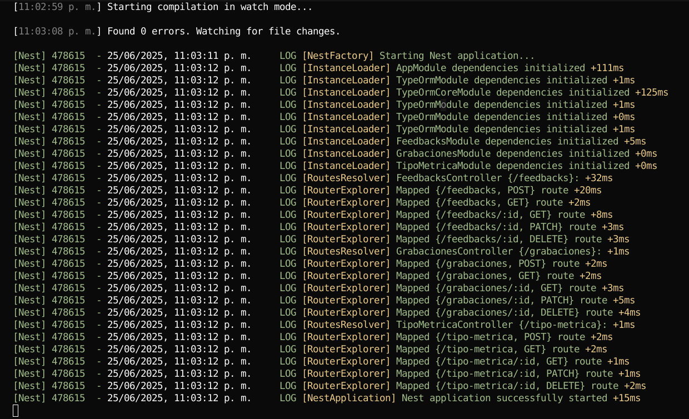
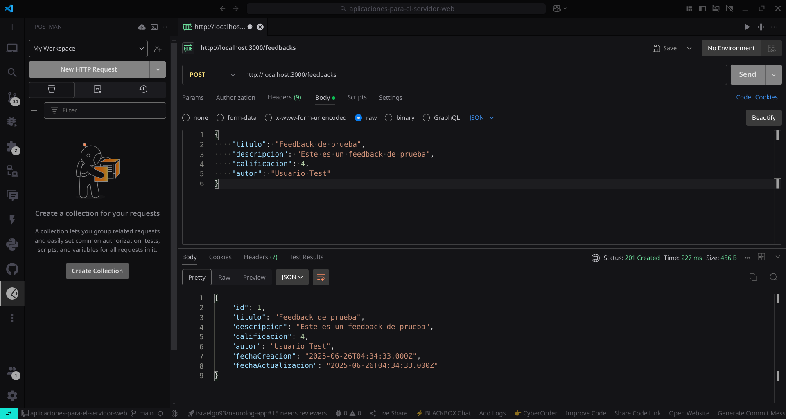
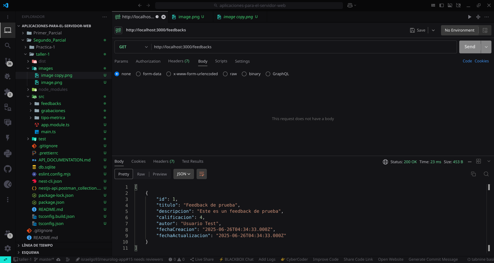

# Taller 1: API REST con NestJS, TypeORM y SQLite

## 📋 Descripción
Este proyecto implementa una API REST completamente funcional utilizando NestJS, estableciendo una conexión a una base de datos SQLite mediante TypeORM. Se implementa la arquitectura de software por capas para tres entidades distintas: Feedbacks, Grabaciones y TipoMetrica.

## 🏗️ Arquitectura Implementada

### Capas de la Aplicación
1. **Presentación**: Controladores que manejan las peticiones HTTP
2. **Lógica de Negocio**: Servicios que contienen la lógica de la aplicación
3. **Acceso a Datos**: TypeORM para la persistencia en SQLite
4. **Entidades**: Modelos de datos con decoradores de TypeORM
5. **DTOs**: Objetos de transferencia de datos con validaciones

### Entidades Implementadas
- **Feedbacks**: Sistema de retroalimentación con calificaciones
- **Grabaciones**: Gestión de archivos de audio/video
- **TipoMetrica**: Tipos de métricas para análisis

## 🚀 Instalación y Configuración

### Prerrequisitos
- Node.js (versión LTS)
- NPM o Yarn
- NestJS CLI: `npm i -g @nestjs/cli`

### Pasos de Instalación

1. **Clonar o navegar al proyecto**
```bash
cd Segundo_Parcial/taller-1
```

2. **Instalar dependencias**
```bash
npm install
```

3. **Ejecutar el proyecto**
```bash
# Modo desarrollo (con hot reload)
npm run start:dev

# Modo producción
npm run start:prod
```

## 📁 Estructura del Proyecto

```
src/
├── app.module.ts                 # Módulo principal con configuración de TypeORM
├── main.ts                       # Punto de entrada de la aplicación
├── feedbacks/                    # Módulo de Feedbacks
│   ├── dto/
│   │   ├── create-feedback.dto.ts
│   │   └── update-feedback.dto.ts
│   ├── entities/
│   │   └── feedback.entity.ts
│   ├── feedbacks.controller.ts
│   ├── feedbacks.service.ts
│   └── feedbacks.module.ts
├── grabaciones/                  # Módulo de Grabaciones
│   ├── dto/
│   │   ├── create-grabacion.dto.ts
│   │   └── update-grabacion.dto.ts
│   ├── entities/
│   │   └── grabacion.entity.ts
│   ├── grabaciones.controller.ts
│   ├── grabaciones.service.ts
│   └── grabaciones.module.ts
└── tipo-metrica/                 # Módulo de TipoMetrica
    ├── dto/
    │   ├── create-tipo-metrica.dto.ts
    │   └── update-tipo-metrica.dto.ts
    ├── entities/
    │   └── tipo-metrica.entity.ts
    ├── tipo-metrica.controller.ts
    ├── tipo-metrica.service.ts
    └── tipo-metrica.module.ts
```

## 🔗 Endpoints Disponibles

### Feedbacks
- `POST /feedbacks` - Crear feedback
- `GET /feedbacks` - Obtener todos los feedbacks
- `GET /feedbacks/:id` - Obtener feedback por ID
- `PATCH /feedbacks/:id` - Actualizar feedback
- `DELETE /feedbacks/:id` - Eliminar feedback

### Grabaciones
- `POST /grabaciones` - Crear grabación
- `GET /grabaciones` - Obtener todas las grabaciones
- `GET /grabaciones/:id` - Obtener grabación por ID
- `PATCH /grabaciones/:id` - Actualizar grabación
- `DELETE /grabaciones/:id` - Eliminar grabación

### TipoMetrica
- `POST /tipo-metrica` - Crear tipo de métrica
- `GET /tipo-metrica` - Obtener todos los tipos de métrica
- `GET /tipo-metrica/:id` - Obtener tipo de métrica por ID
- `PATCH /tipo-metrica/:id` - Actualizar tipo de métrica
- `DELETE /tipo-metrica/:id` - Eliminar tipo de métrica

## 🧪 Pruebas de la API

### Usando Postman

#### 1. Endpoints


#### 2. Ejecutamos POST en feedbacks


#### 3. Ejecutamos GET en feedbacks


### Usando cURL
```bash
# Crear un feedback
curl -X POST http://localhost:3000/feedbacks \
  -H "Content-Type: application/json" \
  -d '{
    "titulo": "Feedback de prueba",
    "descripcion": "Este es un feedback de prueba",
    "calificacion": 4,
    "autor": "Usuario Test"
  }'

# Obtener todos los feedbacks
curl -X GET http://localhost:3000/feedbacks
```

### Usando Thunder Client (VS Code)
1. Instala la extensión Thunder Client en VS Code
2. Importa la colección de Postman
3. Ejecuta las peticiones directamente desde el editor

## 🗄️ Base de Datos

### Configuración
- **Tipo**: SQLite
- **Archivo**: `db.sqlite` (se crea automáticamente)
- **Sincronización**: Automática en desarrollo

### Tablas Creadas
- `feedbacks`: Almacena los feedbacks del sistema
- `grabaciones`: Almacena información de grabaciones
- `tipo_metrica`: Almacena tipos de métricas

## ✅ Validaciones Implementadas

### Feedbacks
- `titulo`: String, longitud 1-255 caracteres
- `descripcion`: String obligatorio
- `calificacion`: Número entre 0-5
- `autor`: String, longitud 1-100 caracteres

### Grabaciones
- `titulo`: String, longitud 1-255 caracteres
- `descripcion`: String obligatorio
- `archivo`: String, longitud 1-255 caracteres
- `duracion`: Número mayor o igual a 0
- `formato`: String opcional, longitud 1-50 caracteres

### TipoMetrica
- `nombre`: String, longitud 1-100 caracteres
- `descripcion`: String obligatorio
- `unidad`: String, longitud 1-50 caracteres
- `activo`: Boolean opcional

## ⚡ Comandos Útiles

```bash
# Desarrollo
npm run start:dev          # Ejecutar con hot reload
npm run start:debug        # Ejecutar en modo debug

# Producción
npm run build              # Compilar el proyecto
npm run start:prod         # Ejecutar en producción

# Testing
npm run test               # Ejecutar tests unitarios
npm run test:e2e           # Ejecutar tests end-to-end
npm run test:cov           # Ejecutar tests con cobertura

# Linting y Formateo
npm run lint               # Ejecutar ESLint
npm run format             # Formatear código con Prettier
```

## ✨ Características Implementadas

✅ **Arquitectura por Capas**: Separación clara entre presentación, lógica de negocio y acceso a datos

✅ **TypeORM Integration**: Configuración completa con SQLite

✅ **Validaciones**: DTOs con decoradores de class-validator

✅ **CRUD Completo**: Operaciones Create, Read, Update, Delete para todas las entidades

✅ **Manejo de Errores**: Excepciones personalizadas y códigos de estado HTTP apropiados

✅ **Documentación**: Documentación completa de la API

✅ **Colección de Postman**: Archivo listo para importar y probar

## 🛠️ Tecnologías Utilizadas

- **NestJS**: Framework para aplicaciones Node.js
- **TypeORM**: ORM para TypeScript y JavaScript
- **SQLite**: Base de datos ligera
- **class-validator**: Validaciones de datos
- **class-transformer**: Transformación de objetos
- **@nestjs/mapped-types**: Utilidades para DTOs


## 📚 Recursos Adicionales

- **Documentación Completa**: `API_DOCUMENTATION.md`
- **Colección Postman**: `nestjs-api.postman_collection.json`
- **Documentación oficial de NestJS**: https://docs.nestjs.com/
- **Documentación de TypeORM**: https://typeorm.io/
